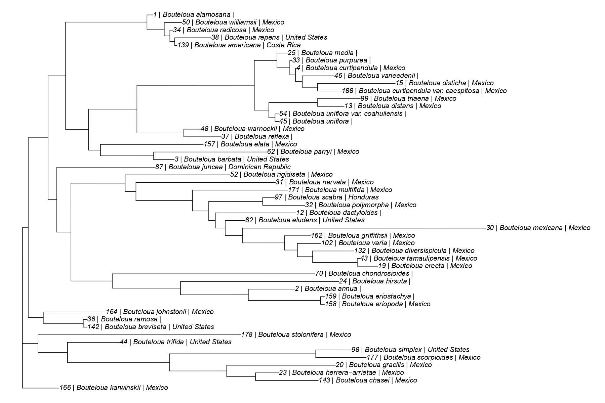

&nbsp;

# Summary

`PhyInsight` is an open-source R package [@R] designed to automate the complicated process of DNA string manipulation and phylogenetic tree creation. This tool provides functions that enable the user to query specimen data, manipulate DNA strings, and create phylogenetic trees effortlessly. This tool was created for beginners who are new to bioinformatics and phylogeny, as well as for experts who will benefit from the streamlined workflow, especially during iterative tasks in exploratory and confirmatory data analysis.

&nbsp;

# Introduction

While existing bioinformatic tools in phylogeny are powerful, they require much work to prepare the data for analysis and phylogenetic tree creation. This hinders reproducibility and uses up valuable research time. By reducing complex processes into a few easy-to-use functions, this package provides automated solutions for DNA string manipulation and phylogenetic tree creation within the R environment [@R]. In doing so, this package reduces the risk of errors, promotes reliability, and saves the user time. Furthermore, this package allows the user to perform complicated analyses without the need for extensive phylogenetic or programming knowledge making it perfect for beginners as well as experts.

&nbsp;

`PhyInsight` incorporates various open-source packages, streamlining and facilitating a wide range of processes essential for phylogenetic analysis. The library includes features from `bold` [@bold] for querying specimen data, `ape` [@ape] for DNA distance calculation, and both `ape` and `Biostrings` [@Biostrings] for object coercion. Additionally, it incorporates features from `DECIPHER` [@DECIPHER] for the orientation and alignment of DNA strings. In short, `PhyInsight` serves as an efficient tool that brings together functionalities, making phylogenetic analysis more efficient and user-friendly.

&nbsp;

Version 0.1.0 is available at the Comprehensive R Archive Network (CRAN) and is maintained on [GitHub](https://github.com/JamesC845/PhyInsight). Furthermore, a [pkgdown website](https://jamesc845.github.io/PhyInsight/) is available to view its functions and vignettes. 

&nbsp;

# Example

The `PhyInsight` package uses three functions to prepare a DNA string set once the specimen data is ready. For conciseness, the code querying and subsetting the specimen data was left out of the example. However, an example of this task can be seen in a [vignette](https://jamesc845.github.io/PhyInsight/articles/PhyloTree_vignette_2.html) on the website. There are three variations of a comprehensive function for string clean-up that can be used to automatically remove problem strings from a string set should the need arise.

&nbsp;

#### Create DNA String Set

```R
# generate a DNA bin using the specimen data frame
DNABin <- genDNABin(specimen_dataframe)

# use the DNA bin to create a DNA string set
DNAStringSet <- genDNAStringSet(DNABin)

# automatically manipulate the DNA strings 
DNAStringSet_manip <- ManipStringSet(DNAStringSet)
```

#### String Clean Up

```R
# use the function to automatically remove problem strings from the DNA string set
BadStringsRemoved <- rmBadStrings_3(
  DNAStringSet_manip,
  specimen_dataframe,
  rmOutliers = TRUE,
  max_Z_score = 4
)

# store the cleaned data into new objects
DNAStringSet_clean <- BadStringsRemoved[[1]]
specimen_dataframe_clean <- BadStringsRemoved[[2]]

# automatically create a phylo tree
PhyloTree <- genPhytree(DNAStringSet_clean)
```

#### Save Phylogenetic Tree

```R
savePhytree(
  PhyloTree,
  specimen_dataframe_clean,
  tree_file_name = "figure.pdf",
  openPDF = TRUE,
  savePDF = TRUE,
  label_size = 0.8,
  label_offset = 0
)
```



&nbsp;

# Improvement

In the future, the package will continue to improve and be updated. Currently, intended updates include:

- methods for automated phylogenetic inference will be added

- queried data will be compiled from multiple databases rather than solely from Bold Systems

- functions for querying, writing, and reading FASTA files will be provided

&nbsp;

# References
